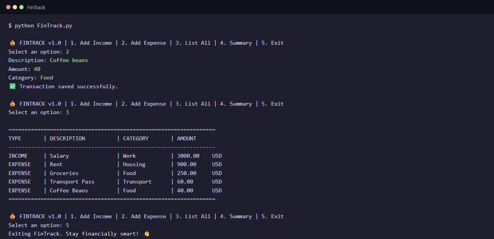
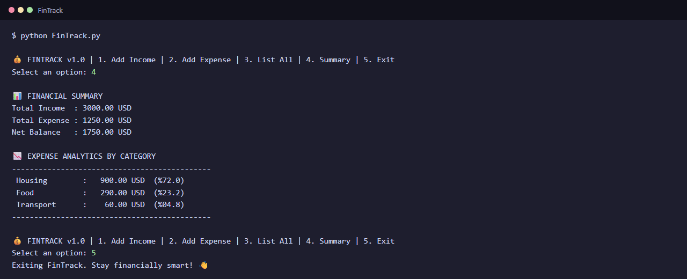

# 💰 FinTrack

A lightweight command-line app for tracking your personal income and expenses, written in Python with no external dependencies.


## ✨ Features

- ➕ **Add income** with a description, amount and category
- ➖ **Add expenses** and see where your money goes
- 📋 **Transaction history** in a clean table
- 📊 **Financial summary:** total income, total expenses and net balance
- 📉 **Expense analytics:** spending per category with percentages, highest first
- 🛡 **Input validation:** rejects invalid or non-positive amounts
- 💾 **Persistent data** saved in `data.json`, so your records survive restarts

## 📸 Screenshots

Real output of the app, shown with sample data.

**Adding an expense and listing all transactions**



**Financial summary with expense analytics by category**



## 🚀 Getting started

Requires Python 3 only (standard library, no extra packages).

```bash
python FinTrack.py
```

## 🎮 Menu

| Option | Action |
|---|---|
| `1. Add Income` | Create a new income record |
| `2. Add Expense` | Create a new expense record |
| `3. List All` | List all transactions as a table |
| `4. Summary` | Show total income, expenses and net balance |
| `5. Exit` | Quit the app |

## 📂 Files

| File | Description |
|---|---|
| `FinTrack.py` | The application |
| `data.json` | Local data storage, created and updated automatically |

---
Developed by [Yusuf Koyuncu](https://github.com/yusuf-koyuncu)
